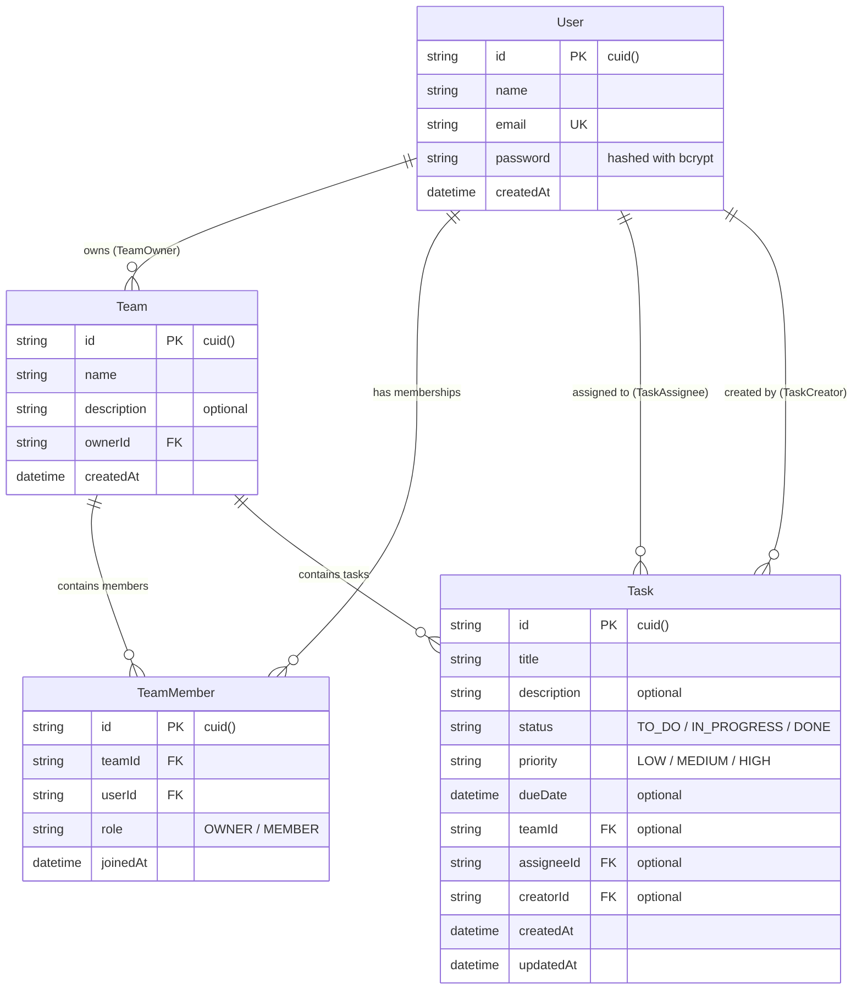

# OrPit – Workspace & Task Management Application
> **Course:** SDN302 – Software Development with Node.js & Cloud Database  
> **Assignment 2:** Task & Team Management App: CRUD API with Authentication  
> **Student:** Le Nguyen Anh Mai  
> **Repository:** [https://github.com/lenguyenanhmai05-dotcom/SDN302_Asm](https://github.com/lenguyenanhmai05-dotcom/SDN302_Asm)  
> **Live Website:** [https://sdn-302-asm-git-main-lenguyenanhmais-projects.vercel.app](https://sdn-302-asm-git-main-lenguyenanhmais-projects.vercel.app)

---

## 📋 Submission Information (Automated Grading Labels)

```text
Student ID: QE123456 (Replace with your Student ID)
Full Name: Le Nguyen Anh Mai
GitHub Repository URL: https://github.com/lenguyenanhmai05-dotcom/SDN302_Asm
Deployed Website URL (Vercel): https://sdn-302-asm-git-main-lenguyenanhmais-projects.vercel.app
Separate Backend URL (NestJS on Render) — write N/A if not used: N/A
Test Account Email: grader.sdn302@gmail.com
Test Account Password: Password123!
This test account is already email-verified / ready to log in immediately, with no confirmation link needed (Yes / No): Yes
Self-registration works, so a grader can create their own account (Yes / No): Yes
```

---

## 📖 1. Project Overview & What's New in Assignment 2

**OrPit v2** extends the application into a full-featured collaborative Task & Team Management workspace:
- **Authentication**: JWT authentication with `jose` and `bcryptjs` password hashing, backed by secure HTTP-only cookies.
- **Relational Data Modeling**: Users, Teams, Team Members with roles (`OWNER`, `MEMBER`), and Tasks assigned to team members.
- **RESTful CRUD APIs**: 15 endpoints covering Auth, Teams, Team Members, and Tasks.
- **Role-Based Authorization**:
  - Only team **Owners** can update team details, invite members by email, remove members, or delete teams.
  - Team members can create tasks and update task details, priority, and assignees.
  - Tasks can only be deleted by the **Task Creator**, the **Task Assignee**, or the **Team Owner**.
- **Interactive Kanban Board View**: Drag/cycle tasks across *To Do*, *In Progress*, and *Done* columns.
- **Multi-Filter & Realtime Search**: Search tasks by keyword and filter simultaneously by Status, Priority, and Assignee.
- **Grader Quick-Fill Button**: A one-click button on the `/login` page to instantly populate the test grader credentials.

---

## 🎨 2. Design System: Red Velvet & Warm Cream Palette

The interface features a custom luxury color palette:

| Token | Hex Code | Visual Reference | Usage |
|:---|:---:|:---:|:---|
| **Velvet Red** | `#AD3029` |  | Primary brand color, CTA buttons, active tabs, Owner badges |
| **Coral Berry** | `#CD5252` |  | High priority badges, hover accents |
| **Dusty Rose** | `#CC8780` |  | Medium priority badges, member badges |
| **Vanilla Cream** | `#FEEFCD` |  | Highlight pills, active filters, stat containers |
| **Warm Ivory** | `#FAF7F2` |  | Canvas background, card surfaces |

---

## 🗄️ 3. Database Schema & ERD (Entity Relationship Diagram)

Defined in [`prisma/schema.prisma`](./prisma/schema.prisma) and migrated to Supabase PostgreSQL:



---

## 🚀 4. RESTful CRUD API Documentation

All 15 endpoints are implemented using Next.js App Router Route Handlers:

| Method | Endpoint | Description | Access / Role Required |
|:---|:---|:---|:---|
| `POST` | `/api/auth/register` | Register new user with hashed password | Public |
| `POST` | `/api/auth/login` | Login and set HTTP-only JWT cookie | Public |
| `POST` | `/api/auth/logout` | Revoke session and clear cookies | Authenticated |
| `GET` | `/api/auth/me` | Fetch active user profile | Authenticated |
| `GET` | `/api/teams` | List teams current user belongs to | Authenticated |
| `POST` | `/api/teams` | Create team (creator is set as Owner) | Authenticated |
| `GET` | `/api/teams/:id` | Get team details, members, and tasks | Team Member / Owner |
| `PUT` | `/api/teams/:id` | Update team name & description | Team Owner only |
| `DELETE` | `/api/teams/:id` | Delete team (cascades to members/tasks) | Team Owner only |
| `POST` | `/api/teams/:id/members` | Add member by email | Team Owner only |
| `DELETE` | `/api/teams/:id/members/:userId` | Remove member from team | Owner or Self (Owner cannot be removed) |
| `GET` | `/api/teams/:id/tasks` | List tasks in team with filters | Team Member / Owner |
| `POST` | `/api/teams/:id/tasks` | Create task within team | Team Member / Owner |
| `PUT` | `/api/tasks/:id` | Update task status, priority, assignee | Team Member / Owner |
| `DELETE` | `/api/tasks/:id` | Delete task | Task Creator, Assignee, or Team Owner |

---

## 🛠️ 5. Self-Assessment Checklist

- [x] **Authentication & Registration**: Users can register with name, email, password; log in; and log out.
- [x] **No Email Confirmation Blocker**: Accounts are active immediately; self-registration works for the grader.
- [x] **Pre-Seeded Test Account**: `grader@sdn302.edu.vn` with password `Password123!`.
- [x] **Teams Dashboard**: List user's teams with Owner/Member badges and member/task metrics.
- [x] **Create Team**: User automatically assigned as `OWNER`.
- [x] **Team Member Management**: Owner can add members by email and remove members.
- [x] **Task Assignments**: Tasks can be assigned to team members with due dates.
- [x] **Role-Based Task Authorization**: Tasks can only be deleted by Creator, Assignee, or Owner.
- [x] **15 RESTful Endpoints**: Full CRUD across Auth, Teams, Members, and Tasks.
- [x] **Bonus – Kanban Board**: Visual status columns with quick move buttons.
- [x] **Bonus – Multi-Criteria Filters**: Filter by Status, Priority, and Assignee.
- [x] **Bonus – Automated Smoke Test**: 15/15 tests passing via `npx tsx scripts/smoke-test-asm2.ts`.

---

## 💻 6. Local Setup & Verification

1. **Clone repository:**
   ```bash
   git clone https://github.com/lenguyenanhmai05-dotcom/SDN302_Asm.git
   cd SDN302_Asm
   ```

2. **Install packages:**
   ```bash
   npm install
   ```

3. **Configure `.env`:**
   ```env
   DATABASE_URL="postgresql://...supabase.com:6543/postgres?pgbouncer=true"
   DIRECT_URL="postgresql://...supabase.com:5432/postgres"
   JWT_SECRET="your-jwt-secret-min-32-chars"
   ```

4. **Seed database with test accounts & sample teams:**
   ```bash
   npx prisma db seed
   ```

5. **Run production build:**
   ```bash
   npm run build
   ```

6. **Run automated API smoke tests:**
   ```bash
   npx tsx scripts/smoke-test-asm2.ts
   ```

---

## 📄 7. Deliverable Report Document

The official submission Word report has been compiled and saved as:
- [`SDN302_Assignment2_Report.docx`](./SDN302_Assignment2_Report.docx)

To re-generate the `.docx` document at any time:
```bash
npx tsx scripts/generate-doc-asm2.ts
```
